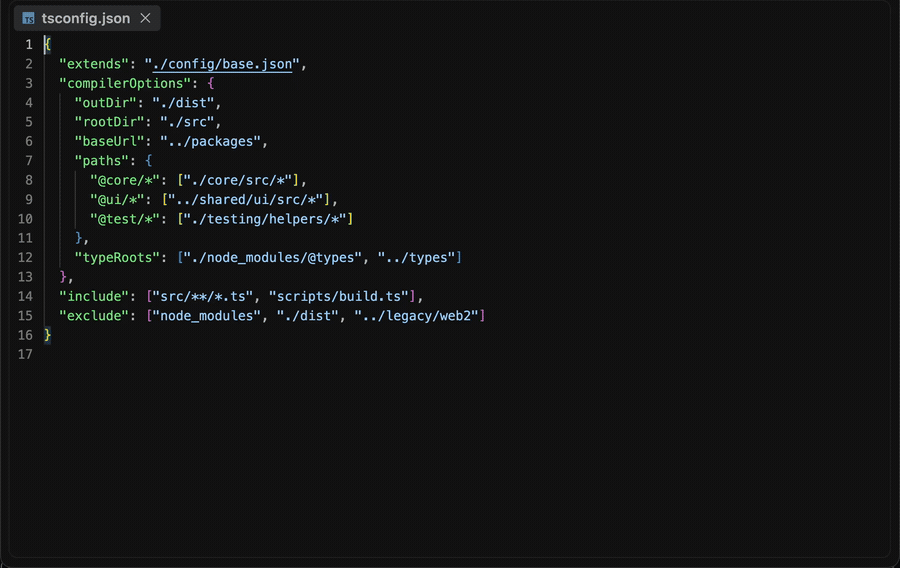

<p align="center">
  
</p>
<h1 align="center">Paths-LE: Zero Hassle Path Extraction</h1>
<p align="center">
  <b>Pull every file path out of the current file in one keystroke</b><br/>
  <i>JavaScript, TypeScript, JSON, YAML, HTML, CSS, TOML, CSV and Environment files — and every other file, by text scan</i>
</p>

<p align="center">
  <a href="https://marketplace.visualstudio.com/items?itemName=nolindnaidoo.paths-le">
    
  </a>
  <a href="https://open-vsx.org/extension/OffensiveEdge/paths-le">
    
  </a>
  <a href="https://www.npmjs.com/package/paths-le-mcp">
    
  </a>
  <a href="https://crates.io/crates/paths-le">
    
  </a>
  <a href="https://letools.dev/tools/paths-le">
    
  </a>
</p>

---

<p align="center">
  
</p>

> **Useful?** A star or rating is how other developers find it —
> [★ GitHub](https://github.com/nolindnaidoo/paths-le) ·
> [★ Open VSX](https://open-vsx.org/extension/OffensiveEdge/paths-le/reviews) ·
> [★ Marketplace](https://marketplace.visualstudio.com/items?itemName=nolindnaidoo.paths-le&ssr=false#review-details)

## What it does

Open a file, press `Ctrl+Alt+P` (`Cmd+Alt+P` on Mac), and every file path in the document lands in a new editor — deduplicate and sort it from there. Works in VS Code and in VS Code–based editors like Cursor and VSCodium (installable from Open VSX).

- **Import analysis** — extract local imports from JS/TS, including multi-line import statements; npm package names are filtered out
- **Asset auditing** — every `src`, `href`, `srcset`, `url()`, and `@import` in HTML/CSS
- **Config review** — path-like values from JSON/JSONC, YAML, TOML, CSV, and `.env` files
- **Anything else** — Python, Go, Markdown, XML, a Dockerfile: no parser, so a text scan finds quoted filenames and any run carrying a path separator

## Install

| Where | What you get | Install |
|---|---|---|
| **VS Code** | The extraction, in your editor, on a keystroke | [Marketplace](https://marketplace.visualstudio.com/items?itemName=nolindnaidoo.paths-le) |
| **Cursor, VSCodium, Windsurf** | The same extension | [Open VSX](https://open-vsx.org/extension/OffensiveEdge/paths-le) |
| **A terminal or a CI step** | The same run over a whole tree, with exit codes | `cargo install paths-le` · [crates.io](https://crates.io/crates/paths-le) |
| **Any MCP agent, via Node** | `extract_paths` over stdio — the same tool this binary offers | `npx paths-le-mcp` · [npm](https://www.npmjs.com/package/paths-le-mcp) |
| **Zed** | The MCP server as a context server | [add it by hand](https://zed.dev/docs/ai/mcp) *(no listing yet)* |

## Use it from an AI agent

The same engine runs as an [MCP](https://modelcontextprotocol.io) server, so an agent can call it directly instead of you running a command.

| Editor | How |
|---|---|
| **VS Code** 1.101+ | Nothing to install — the extension registers `extract_paths` with agent mode |
| **Zed** | No listing yet — [add the MCP server by hand](https://zed.dev/docs/ai/mcp) |
| **Claude Code** | `claude mcp add paths-le -- npx -y paths-le-mcp` |
| **Cursor, Windsurf, anything else** | point it at `npx paths-le-mcp` |

```
extract_paths(content, format?, filename?, dedupe?, maxResults?)
```

Returns every path classified as file, relative, absolute or url, with its 1-based line and column. Paths are reported exactly as written — nothing is resolved against a workspace or touched on disk.

The server takes content and returns data — it reads no files and makes no network requests of its own. Published as [`paths-le-mcp`](https://www.npmjs.com/package/paths-le-mcp) on npm and as `io.github.nolindnaidoo/paths-le` in the [MCP registry](https://registry.modelcontextprotocol.io).

<details>
<summary><b>Configuring it by hand</b> — any host with an MCP config file</summary>

Most hosts read a JSON config. Add one entry:

```json
{
  "mcpServers": {
    "paths-le": {
      "command": "npx",
      "args": ["-y", "paths-le-mcp"]
    }
  }
}
```

`-y` skips the install prompt on first run. Pin a version if you would rather not track releases — `paths-le-mcp@2.3.1`.

Prefer not to go through `npx` on every launch? Install it once and point at the binary instead:

```bash
npm install -g paths-le-mcp
```

```json
{
  "mcpServers": {
    "paths-le": { "command": "paths-le-mcp" }
  }
}
```

It speaks MCP over stdio and needs no environment variables, no API key and no configuration of its own. To check it before wiring it into anything:

```bash
echo '{"jsonrpc":"2.0","id":1,"method":"tools/list"}' | npx -y paths-le-mcp
```

That prints the tool list and exits — if you see `extract_paths`, the server works.

</details>

## The CLI

The same extraction runs from a terminal or an agent loop: a Rust CLI in
[`crate/`](crate/) of this repository, sharing one corpus with the extension —
[`crate/fixtures/`](crate/fixtures/) — so CI fails if the two ever read a
document differently.

It also does the half an editor cannot: **resolve what it found against the
filesystem it is standing in.** Every path gets a verdict — exists, missing,
escapes the audited tree, non-canonical, or a symlink with its target named.

```bash
paths-le .                    # audit a tree; JSON on stdout, summary on stderr
paths-le --strict .           # count sloppily-written paths too
paths-le --no-resolve src/    # just list what is written, touch nothing
paths-le mcp                  # the same audit over MCP on stdio
```

The exit code is the answer: **0 clear · 1 findings · 2 the question was
malformed** — so `paths-le --strict .` is a CI step as it stands.

## Supported formats

| Format | Language IDs | What gets extracted |
|---|---|---|
| JavaScript / TypeScript | `javascript`, `javascriptreact`, `typescript`, `typescriptreact` | `import`/`export … from`, side-effect imports, dynamic `import()`, `require()` — file paths only, package names excluded |
| JSON / JSONC | `json`, `jsonc` | Path-like string values (comments and trailing commas supported) |
| HTML | `html` | `src`, `href`, `srcset` (each entry), `action`, `poster`, and similar attributes |
| CSS / SCSS / LESS | `css`, `scss`, `less` | `url()` and `@import` |
| TOML | `toml` | Path-like values and keys |
| CSV | `csv` | Path-like cells |
| Environment | `dotenv`, `env` | Path-like variable values and names |
| YAML | `yaml` | Path-like scalar values and keys, across every document in the file |
| Everything else | any other language ID | A text scan: quoted tokens, and undelimited runs that carry a path separator |

Positions are real source positions for JS/TS, JSON/JSONC, HTML, CSS and the text scan (exact line and column of the path); TOML and YAML positions are located in the source text and can be approximate for repeated identical values; CSV positions are row/cell coordinates. Version strings (`1.8.1`) and IP addresses are never treated as paths, and `data:`/`javascript:` URLs are excluded from HTML/CSS extraction. Known limitation: bare domains like `example.com` are indistinguishable from filenames and are extracted.

The text scan claims a bare `name.ext` only inside quotes. `os.path` in a Python file and `main.py` are the same shape, and no rule short of a dictionary separates them — but source quotes its filenames and does not quote its attribute access, so the quoting does. A YAML scalar holding a shell command (`run: node ./scripts/build.js`) is one token containing spaces, so no path is claimed from it, exactly as in JSON and TOML.

## Commands

| Command | Description |
|---|---|
| `Paths-LE: Extract Paths` (`Ctrl+Alt+P` / `Cmd+Alt+P`) | Extract all paths from the active document |
| `Paths-LE: Deduplicate Paths` | Remove duplicate lines from the results |
| `Paths-LE: Sort Paths` | Sort results alphabetically or by length |
| `Paths-LE: Open Settings` | Open Paths-LE settings |
| `Paths-LE: Help` | Built-in documentation |

## Settings

| Setting | Default | Description |
|---|---|---|
| `paths-le.openResultsSideBySide` | `true` | Open results beside the current editor |
| `paths-le.postProcess.openInNewFile` | `true` | Open results in a new file (when not side-by-side) |
| `paths-le.copyToClipboardEnabled` | `false` | Also copy results to the clipboard |
| `paths-le.notificationsLevel` | `silent` | `all` = every notification, `important` = warnings + errors, `silent` = errors only |
| `paths-le.safety.enabled` | `true` | Guardrails for very large files |
| `paths-le.safety.fileSizeWarnBytes` | `1000000` | Refuse extraction above this file size |
| `paths-le.safety.largeOutputLinesThreshold` | `50000` | Warn above this line count |
| `paths-le.statusBar.enabled` | `true` | Show the status bar item |
| `paths-le.telemetryEnabled` | `false` | Local-only event log (see Privacy) |
| `paths-le.resolution.resolveSymlinks` | `false` | ⚠️ Resolve symlinks to canonical paths |
| `paths-le.resolution.resolveWorkspaceRelative` | `false` | ⚠️ Resolve paths against workspace folders |

## Languages

Twelve languages besides English:

German · Spanish · French · Indonesian · Italian · Japanese · Korean ·
Portuguese (Brazil) · Russian · Ukrainian · Vietnamese · Chinese (Simplified)

Both halves are covered — the manifest (command titles, setting names and
descriptions) and everything shown while the extension runs (notifications,
the status bar, quick-picks and prompts). The extension follows VS Code's
display language, so it matches whatever the editor is already set to; no
setting of its own.

## Privacy & security

- **No network access.** The extension never sends data anywhere. The `telemetryEnabled` setting only writes events to a local Output Channel you can inspect (`Paths-LE Telemetry`).
- **Canonical resolution is opt-in and warned.** Resolving symlinks/workspace-relative paths can put absolute filesystem paths into the results document; the extension warns before first use. Leave both `resolution.*` settings off unless you need them.
- **The MCP server holds the same line.** It takes content as an argument and returns data: no filesystem access, no network calls, no telemetry. Your agent already has file-read tools, so duplicating them inside the server would add a path-traversal surface for no capability. `check:mcp-bundle` fails the build if the server ever imports something that could reach either.
- Error notifications redact home directories and credential-shaped fragments.

## Documentation

| What | Where |
|---|---|
| What the tool is allowed to say — scope, output contract, refusals, non-goals | [`crate/SPEC.md`](crate/SPEC.md) |
| How the extension is built and held together — architecture, invariants, toolchain, release | [AGENTS.md](AGENTS.md) |
| How the CLI is built and held together | [`crate/AGENTS.md`](crate/AGENTS.md) |
| What changed | [CHANGELOG.md](CHANGELOG.md) · [`crate/CHANGELOG.md`](crate/CHANGELOG.md) |
| The tool's page, and the other fifteen | [letools.dev/tools/paths-le](https://letools.dev/tools/paths-le) |

## Performance

<!-- performance:start -->
| Input | Size | Found | Time | Rate | Scan speed |
| --- | --- | --- | --- | --- | --- |
| TypeScript imports | 2.10 MB | 40,000 | 20.4 ms | 1,960,564/sec | 103.1 MB/s |
| JSON config | 1.17 MB | 40,001 | 25.1 ms | 1,593,917/sec | 46.7 MB/s |
| HTML document | 1.27 MB | 40,000 | 17.57 ms | 2,277,234/sec | 72 MB/s |
| CSS stylesheet | 1.57 MB | 40,000 | 18.59 ms | 2,151,130/sec | 84.5 MB/s |
| CSV data | 2.09 MB | 60,000 | 57.33 ms | 1,046,485/sec | 36.5 MB/s |

Median of 7 runs after warmup, on Apple M5 Pro, 24 GB RAM, Node 24.3.0. Inputs are generated
by `scripts/benchmark.ts` rather than checked in, so the sizes above are
exactly what was measured. Reproduce with `bun run benchmark`.

These are machine-specific and are not asserted in CI — a benchmark that gates
a build only tells you how busy the runner was.
<!-- performance:end -->

## Testing

<!-- coverage:start -->
| Metric | Coverage |
| --- | --- |
| Statements | 92.04% |
| Branches | 85.65% |
| Functions | 94.55% |
| Lines | 92.83% |

296 test cases across 22 files, plus an integration suite that runs
in a real VS Code extension host and an end-to-end test that installs the
built `.vsix` into a clean profile.

Generated from a real run — `coverage/coverage-summary.json` and
`coverage/test-results.json` — by `scripts/coverage-readme.js`; CI fails if
this section drifts. Reproduce with `bun run test:coverage`, and the case
count is the one vitest prints.
<!-- coverage:end -->

## More from the LE family

Sixteen single-purpose tools for the work in front of every model. Each ships
a Rust CLI and an MCP server. One page: **[letools.dev](https://letools.dev)**

**Get it out**

- **[String-LE](https://letools.dev/tools/string-le)** — Extract every string in a codebase, with its position, so a person can read them
- **[Numbers-LE](https://letools.dev/tools/numbers-le)** — Extract every hardcoded number in a codebase, so a person can check them
- **[Units-LE](https://letools.dev/tools/units-le)** — Extract every quantity with its unit, normalized, and refuse the ambiguous ones by name
- **[Dates-LE](https://letools.dev/tools/dates-le)** — Extract every date and timestamp, and the exact instant each one resolves to
- **[IDs-LE](https://letools.dev/tools/ids-le)** — Extract every UUID, ULID, NanoID, ObjectId and Snowflake, and decode the time inside
- **[IPs-LE](https://letools.dev/tools/ips-le)** — Extract every IP address, CIDR block and MAC, normalized and classified by scope
- **[URLs-LE](https://letools.dev/tools/urls-le)** — Extract every URL in a codebase, with its protocol and exact position
- **[Paths-LE](https://letools.dev/tools/paths-le)** — Extract every file path in a codebase, and say whether it still points at anything
- **[Colors-LE](https://letools.dev/tools/colors-le)** — Extract every color in a codebase, and say which ones are not in your palette

**Check it**

- **[Regex-LE](https://letools.dev/tools/regex-le)** — Find every regex in a codebase, and report which can be driven into catastrophic backtracking
- **[Versions-LE](https://letools.dev/tools/versions-le)** — Find where one dependency is constrained differently across a repository's manifests
- **[i18n-LE](https://letools.dev/tools/i18n-le)** — Identify the i18n library a project uses, then audit its catalogs by that library's rules
- **[Scrape-LE](https://letools.dev/tools/scrape-le)** — Check whether a page is scrapeable before the scraper is written, and say when it cannot tell

**Guard it**

- **[Secrets-LE](https://letools.dev/tools/secrets-le)** — Find hardcoded credentials in a codebase, and never print one into the report
- **[EnvSync-LE](https://letools.dev/tools/envsync-le)** — Compare the dotenv files in a tree, and say which keys are missing from which
- **[Unicode-LE](https://letools.dev/tools/unicode-le)** — Find the Unicode that hides meaning — bidi controls, invisibles, homoglyphs, mixed scripts

Each stands on its own: no shared crate, no published core. Where two of them
agree, it is because the same answer was right twice.

**Contact** — [nolindnaidoo.com](https://nolindnaidoo.com) · [GitHub](https://github.com/nolindnaidoo) · [LinkedIn](https://www.linkedin.com/in/nolindnaidoo/)

## Also by nolindnaidoo

**Rust** — pixelcoords and pixelactions are one loop: pixelcoords answers
*where*, pixelactions *acts* there. Their own tools, their own voice — not
part of the LE family.

- **[pixelcoords](https://github.com/nolindnaidoo/pixelcoords)** — Freeze your screen, mark regions, get pixel-exact coordinates and crops
  [pixelcoords.dev](https://pixelcoords.dev) · [crates.io](https://crates.io/crates/pixelcoords) · [docs.rs](https://docs.rs/pixelcoords)
- **[pixelactions](https://github.com/nolindnaidoo/pixelactions)** — Consume human-verified coordinates, perform the interaction, confirm it landed
  [pixelactions.dev](https://pixelactions.dev) · [crates.io](https://crates.io/crates/pixelactions) · [docs.rs](https://docs.rs/pixelactions)

## License

MIT © [nolindnaidoo](https://github.com/nolindnaidoo)
