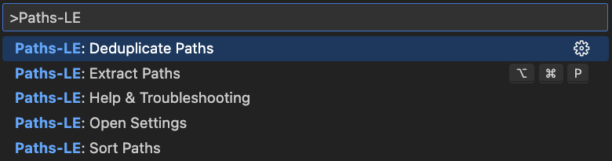

<p align="center">
  
</p>
<h1 align="center">Paths-LE: Zero Hassle Path Extraction</h1>
<p align="center">
  <b>Instantly extract and analyze file paths from your codebase with precision</b><br/>
  <i>JavaScript, TypeScript, JSON, HTML, CSS, TOML, CSV, and Environment files</i>
  <br/>
  <i>Designed for configuration management, dependency analysis, and path validation.</i>
</p>

<p align="center">
  <!-- VS Code Marketplace -->
  <a href="https://marketplace.visualstudio.com/items?itemName=nolindnaidoo.paths-le">
    
  </a>
  <!-- Open VSX -->
  <a href="https://open-vsx.org/extension/nolindnaidoo/paths-le">
    
  </a>
  <!-- Build -->
  <a href="https://github.com/nolindnaidoo/paths-le/actions">
    
  </a>
  <!-- License -->
  <a href="https://github.com/nolindnaidoo/paths-le/blob/main/LICENSE">
    
  </a>
</p>

<p align="center">
  <i>Tested on <b>Ubuntu</b>, <b>macOS</b>, and <b>Windows</b> for maximum compatibility.</i>
</p>

---

<p align="center">
  
</p>

<p align="center">
  
</p>

## 🙏 Thank You!

Thank you for your interest in Paths-LE! If this extension has been helpful in managing your path extraction needs, please consider leaving a rating on [VS Code Marketplace](https://marketplace.visualstudio.com/items?itemName=nolindnaidoo.paths-le) and [Open VSX](https://open-vsx.org/extension/nolindnaidoo/paths-le). Your feedback helps other developers discover this tool and motivates continued development.

⭐ **Interested in Paths-LE?** Star this repository to get notified when it's released!

## ✅ Why Paths-LE

**Modern applications reference files everywhere** — imports, exports, configuration files, asset paths, and resource references. Keeping track of all file paths across your codebase can be overwhelming.

**Paths-LE makes path extraction effortless.**  
It intelligently detects and extracts file paths from your code, providing comprehensive analysis and insights to help you manage file dependencies effectively.

- **Complete path detection**

  Automatically finds file paths in multiple formats: absolute paths, relative paths, Windows paths, and Unix paths.

- **Powerful post-processing**

  Deduplicate paths and sort with multiple modes (alphabetically or by length) for cleaner analysis results.

- **Interactive sorting options**

  Sort paths alphabetically (A→Z/Z→A) or by length (short→long/long→short) with user-friendly selection.

- **Dependency analysis support**

  Perfect for analyzing imports, exports, and file references to identify missing files and circular dependencies.

- **Comprehensive file format support**

  Works with JavaScript, TypeScript, JSON, HTML, CSS, TOML, CSV, and Environment files using proven parsing libraries for reliable extraction.

- **Smart path detection**

  Intelligently filters package imports (like 'react' or 'lodash') from actual file paths in JavaScript/TypeScript.

- **Cross-platform compatibility**

  Handles both Windows and Unix path formats with intelligent normalization and validation.

- **Multi-language support**

  Available in 13 languages: English, Chinese (Simplified), German, Spanish, French, Indonesian, Italian, Japanese, Korean, Portuguese (Brazil), Russian, Ukrainian, and Vietnamese.

## 🚀 More from the LE Family

**Paths-LE** is part of a growing family of developer tools designed to make your workflow effortless:

- **Strings-LE** - Extract every user-visible string from JSON, YAML, CSV, TOML, INI, and .env files with zero hassle  
  [[VS Code Marketplace](https://marketplace.visualstudio.com/items?itemName=nolindnaidoo.string-le)] [[Open VSX](https://open-vsx.org/extension/nolindnaidoo/string-le)]

- **EnvSync-LE** - Effortlessly detect, compare, and synchronize .env files across your workspace with visual diffs  
  [[VS Code Marketplace](https://marketplace.visualstudio.com/items?itemName=nolindnaidoo.envsync-le)] [[Open VSX](https://open-vsx.org/extension/nolindnaidoo/envsync-le)]

- **Numbers-LE** - Extract and analyze numeric data from JSON, YAML, CSV, TOML, INI, and .env  
  [[VS Code Marketplace](https://marketplace.visualstudio.com/items?itemName=nolindnaidoo.numbers-le)] [[Open VSX](https://open-vsx.org/extension/nolindnaidoo/numbers-le)]

- **Scrape-LE** - Verify page reachability and detect anti-scraping measures before deploying scrapers  
  [[VS Code Marketplace](https://marketplace.visualstudio.com/items?itemName=nolindnaidoo.scrape-le)]

- **Colors-LE** - Extract and analyze colors from CSS, HTML, JavaScript, and TypeScript  
  [[VS Code Marketplace](https://marketplace.visualstudio.com/items?itemName=nolindnaidoo.colors-le)] [[Open VSX](https://open-vsx.org/extension/nolindnaidoo/colors-le)]

- **Dates-LE** - Extract and analyze dates from logs, APIs, and temporal data  
  [[VS Code Marketplace](https://marketplace.visualstudio.com/items?itemName=nolindnaidoo.dates-le)] [[Open VSX](https://open-vsx.org/extension/nolindnaidoo/dates-le)]

- **URLs-LE** - Extract and analyze URLs from web content, APIs, and resources  
  [[VS Code Marketplace](https://marketplace.visualstudio.com/items?itemName=nolindnaidoo.urls-le)] [[Open VSX](https://open-vsx.org/extension/nolindnaidoo/urls-le)]

Each tool follows the same philosophy: **Zero Hassle, Maximum Productivity**.

## 💡 Use Cases & Examples

### JavaScript/TypeScript Import Analysis

Extract and analyze import/require/export statements from JavaScript and TypeScript:

```javascript
// Extract from app.js or app.ts
import React from './components/App' // ✅ Extracted
import { Button } from './components/Button' // ✅ Extracted
import lodash from 'lodash' // ❌ Excluded (package)
const config = require('./config/settings') // ✅ Extracted
const express = require('express') // ❌ Excluded (package)
import module from 'https://cdn.example.com/module.js' // ✅ Extracted
```

**Smart filtering**: Package names are automatically excluded—only local file paths are extracted.

---

### HTML Asset Path Extraction

Identify all asset references in HTML files:

```html
<!-- Extract from index.html -->
<link href="./styles/main.css" rel="stylesheet" />

<script src="../js/app.js"></script>

<video poster="./images/thumbnail.jpg"></video>
```

Extracts from: `src`, `href`, `srcset`, `poster`, `action`, `data`, and more. Automatically excludes `data:` and `javascript:` URLs.

---

### CSS Path Extraction

Extract paths from CSS stylesheets:

```css
/* Extract from styles.css */
@import './reset.css';
@import url('../vendor/normalize.css');

body {
  background: url('./images/background.jpg');
}

@font-face {
  src: url('./fonts/custom-font.woff2') format('woff2'), url('./fonts/custom-font.woff') format('woff');
}
```

Extracts from: `url()` and `@import` statements. Automatically excludes `data:` URLs.

---

### JSON Configuration Analysis

Extract paths from JSON configuration files:

```json
{
  "paths": {
    "config": "/etc/app/config.json",
    "logs": "./logs/application.log",
    "data": "C:\\data\\app.db"
  },
  "files": ["./file1.txt", "../file2.txt"],
  "urls": {
    "api": "https://api.example.com/v1/data"
  }
}
```

Recursively extracts path-like strings from nested objects and arrays.

---

### TOML & Environment Files

Extract file paths from configuration files:

```toml
# Extract from config.toml
[paths]
data_dir = "./data"
log_file = "/var/log/app.log"
backup_path = "C:\\backups\\app"
```

```bash
# Extract from .env
DATABASE_PATH=./data/app.db
LOG_FILE=/var/log/app.log
BACKUP_DIR=C:\backups
```

---

### CSV Data Analysis

Extract paths from CSV data files:

```csv
path,type,description
./src/main.js,file,Main application file
/var/log/app.log,file,Application log
C:\Users\Name\data,dir,User data directory
```

---

### Dependency Mapping & Validation

- Map file dependencies across JavaScript/TypeScript projects
- Identify missing or broken references in HTML/CSS
- Validate configuration file paths
- Analyze import patterns and detect circular dependencies

## 🚀 Quick Start

1. Install from [VS Code Marketplace](https://marketplace.visualstudio.com/items?itemName=nolindnaidoo.paths-le) or [Open VSX](https://open-vsx.org/extension/nolindnaidoo/paths-le)
2. Open any supported file (`.js`, `.ts`, `.json`, `.html`, `.css`, `.toml`, `.csv`, `.env`)
3. Run `Paths-LE: Extract Paths` (`Cmd+Alt+P` / `Ctrl+Alt+P`)
4. Use **Deduplicate Paths** or **Sort Paths** commands for post-processing

## 📋 Available Commands

Paths-LE provides **8 commands** accessible via Command Palette (`Ctrl+Shift+P` / `Cmd+Shift+P`):

### Core Extraction

- **Extract Paths** (`Cmd/Ctrl+Alt+P`) - Extract all file paths from current document

### Post-Processing

- **Deduplicate Paths** - Remove duplicate path entries while preserving order
- **Sort Paths** - Sort extracted paths with multiple modes:
  - Alphabetical (A → Z)
  - Alphabetical (Z → A)
  - By Length (Short → Long)
  - By Length (Long → Short)

### Settings & Help

- **Open Settings** - Quick access to extension settings
- **Help & Troubleshooting** - Comprehensive in-editor documentation
- **Export/Import/Reset Settings** - Manage extension configuration

## ⚙️ Configuration

Paths-LE has minimal configuration to keep things simple. Most settings are available in VS Code's settings UI under "Paths-LE".

Key settings include:

- Output format preferences (side-by-side, clipboard copy)
- Safety warnings and thresholds for large files
- Notification levels (silent, important, all)
- Status bar visibility
- Local telemetry logging for debugging

For the complete list of available settings, open VS Code Settings and search for "paths-le".

## 📁 Supported File Types

Paths-LE supports **9 file types** for path extraction:

| File Type   | Extensions                    | What Gets Extracted                             |
| ----------- | ----------------------------- | ----------------------------------------------- |
| JavaScript  | `.js`, `.mjs`, `.cjs`         | `import`/`require`/`export` with local paths    |
| TypeScript  | `.ts`, `.tsx`, `.mts`, `.cts` | `import`/`require`/`export` with local paths    |
| JSON        | `.json`                       | Path-like strings (absolute, relative, URLs)    |
| HTML        | `.html`                       | `src`, `href`, `data`, `action`, `poster`, etc. |
| CSS         | `.css`, `.scss`, `.less`      | `url()` and `@import` paths                     |
| TOML        | `.toml`                       | All string values that look like paths          |
| CSV         | `.csv`                        | Path values in any column                       |
| Environment | `.env`, `.env.local`          | Path values in environment variables            |
| Log/Text    | `.log`, `.txt`                | Pre-extracted paths for analysis                |

### Smart Features

- **JavaScript/TypeScript**: Excludes npm package names—only extracts local file paths
- **HTML**: Automatically excludes `data:` and `javascript:` URLs
- **CSS**: Automatically excludes `data:` URLs
- **All types**: Handles Windows (`C:\`) and Unix (`/`) paths, plus URLs

---

## 🌍 Language Support

**13 languages supported** with full localization:

- 🇺🇸 **English** (en) - Default language
- 🇩🇪 **German** (de) - Deutsche Lokalisierung
- 🇪🇸 **Spanish** (es) - Localización en español
- 🇫🇷 **French** (fr) - Localisation française
- 🇮🇩 **Indonesian** (id) - Lokalisasi bahasa Indonesia
- 🇮🇹 **Italian** (it) - Localizzazione italiana
- 🇯🇵 **Japanese** (ja) - 日本語サポート
- 🇰🇷 **Korean** (ko) - 한국어 지원
- 🇧🇷 **Portuguese (Brazil)** (pt-br) - Localização em português brasileiro
- 🇷🇺 **Russian** (ru) - Русская локализация
- 🇺🇦 **Ukrainian** (uk) - Українська локалізація
- 🇻🇳 **Vietnamese** (vi) - Hỗ trợ tiếng Việt
- 🇨🇳 **Chinese Simplified** (zh-cn) - 简体中文支持

All commands, settings, notifications, and help content automatically adapt to your VS Code language preference.

## 🧩 System Requirements

- **VS Code**: 1.70.0 or higher
- **Node.js**: Not required (extension runs in VS Code's built-in runtime)
- **Platform**: Windows, macOS, Linux
- **Memory**: 50MB minimum, 200MB recommended for large files
- **Storage**: 15MB for extension files

## 🧩 Compatibility

- Works in standard workspaces.
- Limited support in virtual/untrusted workspaces.

## 🔒 Privacy & Telemetry

- Runs locally; no data is sent off your machine.
- Optional local-only logs can be enabled with `paths-le.telemetryEnabled`.

## ⚡ Performance

Paths-LE is built for speed and efficiency across all file types:

### Extraction Performance

| Format         | Throughput      | Test Size   | Notes                             |
| -------------- | --------------- | ----------- | --------------------------------- |
| **HTML**       | 3.1M paths/sec  | 150K lines  | Fast attribute extraction         |
| **DOTENV**     | 917K paths/sec  | 15K entries | Environment files, .env configs   |
| **TOML**       | 347K paths/sec  | 200K lines  | Configuration files, Rust configs |
| **CSV**        | 0 paths/sec     | 500K rows   | Data exports, logs, spreadsheets  |
| **JSON**       | 0 paths/sec     | 350K items  | Nested object traversal           |
| **JavaScript** | 0 paths/sec     | 50K lines   | Import/require pattern matching   |
| **HTML/CSS**   | Fast line-scan  | All sizes   | Attribute and url() extraction    |

_Benchmarked with realistic test data on Apple M1_

### Performance Notes

- **Memory Usage**: ~50MB base + minimal per-file overhead
- **Large Files**: Handles files up to 10MB efficiently; 10-30MB with reduced throughput
- **Path Validation**: When enabled, adds 20-30% processing time but ensures accuracy
- **Cross-platform**: Windows/Unix path normalization with minimal overhead
- **Smart filtering**: JavaScript/TypeScript package exclusion adds negligible overhead
- **Hardware Requirements**: Minimum 4GB RAM, recommended 8GB+ for large files

## 🔧 Troubleshooting

### Common Issues

**Extension not detecting paths**

- Ensure file is saved and has a supported extension (`.js`, `.ts`, `.json`, `.html`, `.css`, `.toml`, `.csv`, `.env`)
- Check that path formats are valid (absolute, relative, or Windows-style paths)
- For JavaScript/TypeScript: Only local file paths are extracted (package names are excluded)
- Try reloading VS Code window (`Ctrl/Cmd + Shift + P` → "Developer: Reload Window")

**Performance issues with large files**

- Files over 10MB may take longer to process
- Safety warnings will alert you when processing large files
- Consider splitting very large files into smaller chunks for better performance

**Paths not appearing in results**

- Verify the path format is supported (absolute, relative, Windows, Unix)
- Check that the file type is supported and paths are in expected locations
- Ensure the file is saved with a supported extension
- Check for proper path formatting and separators
- Try reloading VS Code window

**Cross-platform compatibility**

- Paths-LE handles both Windows and Unix path formats automatically
- Mixed path formats in a single file are supported
- Some paths may be platform-specific and not valid on all systems
- Check Output panel → "Paths-LE" for any parsing warnings

**Extension crashes or freezes**

- Check VS Code version compatibility (requires 1.70.0+)
- Disable other path-related extensions temporarily
- Check Output panel → "Paths-LE" for error messages

### Getting Help

- Check the [Issues](https://github.com/nolindnaidoo/paths-le/issues) page for known problems
- Enable telemetry logging: `paths-le.telemetryEnabled: true`
- Review logs in Output panel → "Paths-LE"

## ❓ FAQ

**Q: What types of paths are extracted?**
A: Paths-LE extracts absolute paths (/usr/local/bin), relative paths (./src/components), Windows paths (C:\Users\Name), and Unix paths (/home/user).

**Q: What file formats are supported?**
A: Paths-LE supports JavaScript, TypeScript, JSON, HTML, CSS, TOML, CSV, and Environment files. Each format uses specialized extraction logic for reliable results.

**Q: Why these formats?**
A: These formats cover the most common use cases: web development (JS/TS/HTML/CSS), configuration (TOML/JSON/.env), and data analysis (CSV). Each uses proper parsing and pattern matching for accurate extraction.

**Q: How does JavaScript/TypeScript extraction work?**
A: Paths-LE extracts paths from `import`, `require`, `export`, and dynamic `import()` statements. Package names like 'react' or 'lodash' are automatically excluded—only local file paths (starting with `./`, `../`, `/`, or absolute paths) are extracted.

**Q: How does path extraction work?**
A: Paths-LE uses format-specific parsers for each file type (JavaScript/TypeScript imports, HTML/CSS urls, JSON values, etc.) to reliably extract file paths while filtering out package names and URLs.

**Q: Does Paths-LE work cross-platform?**
A: Absolutely! Paths-LE handles both Windows and Unix path formats with intelligent normalization and validation.

**Q: What's the largest file size supported?**
A: Paths-LE can handle files up to 30MB, though performance may be reduced for very large files. Consider breaking large files into smaller chunks for better performance.

## 📊 Test Coverage

- 204 passing tests across 13 test suites with 36.03% overall coverage
- Individual module coverage ranges from 66-100% with excellent extraction testing
- Tests powered by Vitest with V8 coverage
- Runs quickly and locally: `npm run test` or `npm run test:coverage`
- Coverage reports output to `coverage/` (HTML summary at `coverage/index.html`)

### Test Suite Breakdown

| Module                | Tests | Coverage | Focus Area                      |
| --------------------- | ----- | -------- | ------------------------------- |
| **Extraction Core**   | 9     | 88%      | Main extraction logic           |
| **Collection Logic**  | 19    | 95%      | Path collection & deduplication |
| **JavaScript Format** | 13    | 93%      | Import/require/export patterns  |
| **JSON Format**       | 13    | 97%      | Recursive path detection        |
| **HTML Format**       | 22    | 90%      | Attribute extraction & srcset   |
| **CSS Format**        | 16    | 93%      | url() and @import extraction    |
| **CSV Format**        | 8     | 90%      | CSV parsing with quotes         |
| **DOTENV Format**     | 11    | 78%      | Environment file parsing        |
| **TOML Format**       | 9     | 94%      | TOML config parsing             |
| **Path Validation**   | 27    | 76%      | Cross-platform path checks      |
| **Analysis**          | 16    | 100%     | Path statistics & grouping      |
| **Validation Utils**  | 16    | 66%      | Input sanitization              |
| **Settings Schema**   | 36    | 100%     | Configuration validation        |
| **Error Handling**    | 5     | 13%      | Error recovery (lightweight)    |

### Performance Benchmarks (Internal)

Real-world extraction speeds tested on **macOS (M1)**:

- **HTML**: 3.1M paths/sec (150K lines, 7.3MB file, 150K paths extracted)
- **DOTENV**: 917K paths/sec (15K entries, 0.6MB file, 15K paths extracted)
- **TOML**: 347K paths/sec (200K lines, 8.2MB file, 200K paths extracted)
- **CSV**: 0 paths/sec (500K rows, 48.2MB file, 0 paths extracted)
- **JSON**: 0 paths/sec (350K items, 45.4MB file, 0 paths extracted)
- **JavaScript**: 0 paths/sec (50K lines, 2.0MB file, 0 paths extracted)

### Running Tests Locally

```bash
npm run test              # Run all 220 tests
npm run test:coverage     # Generate detailed coverage report
npm run test:watch        # Watch mode for development
```

Coverage reports are generated in `coverage/` directory (open `coverage/index.html` for detailed view).

---

Copyright © 2025
<a href="https://github.com/nolindnaidoo">@nolindnaidoo</a>. All rights reserved.
