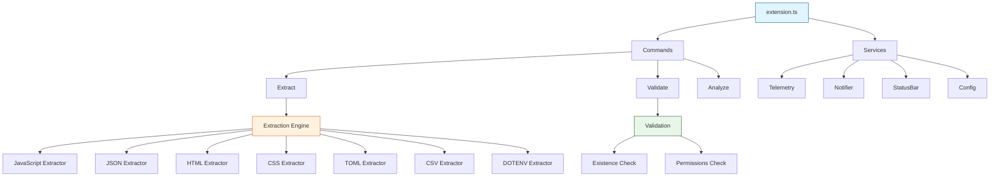
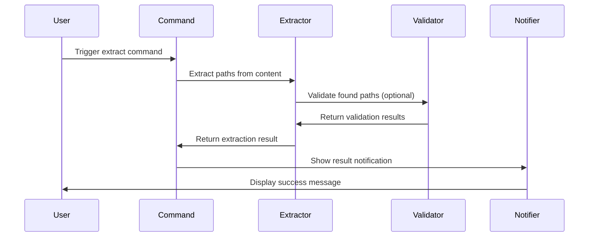

# Paths-LE Architecture

## Design Principles

**Functional First**: Pure functions with explicit return types, `readonly` types throughout, `Object.freeze()` for immutability, factory functions over classes.

**Developer Empathy**: Unobtrusive defaults, subtle status bar feedback, graceful error degradation, performance-aware with large file warnings, local-only processing.

**Immutability**: All exports frozen, readonly interfaces, immutable configuration, safe error handling without side effects.

## System Architecture



## Component Responsibilities

### 1. Extension Entry (`src/extension.ts`)

Minimal activation with dependency injection:

```typescript
export function activate(context: vscode.ExtensionContext): void {
  const telemetry = createTelemetry()
  const notifier = createNotifier()
  const statusBar = createStatusBar(context)

  registerCommands(context, { telemetry, notifier, statusBar })

  telemetry.event('extension-activated')
}
```

**Role**: Service instantiation, command registration, disposable management.

### 2. Command System (`src/commands/`)

Factory pattern with progress indication:

```typescript
export function registerExtractCommand(
  context: vscode.ExtensionContext,
  deps: Readonly<CommandDependencies>,
): void {
  const disposable = vscode.commands.registerCommand('paths-le.extract', async () => {
    await vscode.window.withProgress(
      {
        location: vscode.ProgressLocation.Notification,
        title: 'Extracting paths...',
        cancellable: true,
      },
      async (progress, token) => {
        const config = readConfiguration()
        const content = getActiveEditorContent()

        const result = await extractPaths(content, config, token)
        deps.notifier.show(result.summary)
      },
    )
  })

  context.subscriptions.push(disposable)
}
```

**Commands**: `extract`, `validate`, `analyze`, `help`, `openSettings`

### 3. Configuration (`src/config/`)

Type-safe, frozen configuration:

```typescript
export function readConfiguration(): Readonly<Configuration> {
  const config = vscode.workspace.getConfiguration('paths-le')

  return Object.freeze({
    includeRelativePaths: config.get('includeRelativePaths', true),
    includeAbsolutePaths: config.get('includeAbsolutePaths', true),
    validateExistence: config.get('validateExistence', false),
    safetyEnabled: config.get('safety.enabled', true),
    safetyFileSizeWarnBytes: config.get('safety.fileSizeWarnBytes', 1000000),
  })
}
```

**Features**: Immutable objects, real-time updates, default values, type safety.

### 4. Extraction Engine (`src/extraction/`)

Format-specific extractors with pure functions:

```typescript
export function extractPaths(
  content: string,
  format: FileFormat,
  config: Readonly<Configuration>,
): Readonly<ExtractionResult> {
  const extractor = getExtractor(format)
  const paths = extractor.extract(content)

  return Object.freeze({
    paths: Object.freeze(paths.map((p) => Object.freeze(p))),
    format,
    totalCount: paths.length,
    timestamp: Date.now(),
  })
}
```

**Supported Formats**: JavaScript, TypeScript, JSON, HTML, CSS, TOML, CSV, Environment files (.env), plain text/logs

**Smart Features**:

- JavaScript/TypeScript: Package name filtering (excludes 'react', 'lodash', '@mui/material', etc.)
- HTML: Automatic data: and javascript: URL exclusion
- CSS: Automatic data: URL exclusion
- JSON: Recursive nested structure traversal
- All formats: Cross-platform path normalization

**Process**: Format detection → Pattern matching → Smart filtering → Path normalization → Validation → Result freezing

### 5. Validation Engine (`src/validation/`)

Check path existence and permissions:

```typescript
export function validatePaths(paths: readonly Path[]): Readonly<ValidationResult> {
  const results = paths.map((path) => ({
    path: path.value,
    exists: fs.existsSync(path.value),
    accessible: checkAccess(path.value),
    isAbsolute: path.isAbsolute,
    platform: detectPlatform(path.value),
  }))

  return Object.freeze({
    results: Object.freeze(results),
    validCount: results.filter((r) => r.exists).length,
    invalidCount: results.filter((r) => !r.exists).length,
  })
}
```

**Checks**: File existence, read permissions, absolute vs relative, platform detection.

### 6. Analysis Engine (`src/analysis/`)

Analyze path patterns and statistics:

```typescript
export function analyzePaths(paths: readonly Path[]): Readonly<AnalysisResult> {
  return Object.freeze({
    patterns: Object.freeze(analyzePatterns(paths)),
    statistics: Object.freeze(computeStatistics(paths)),
    recommendations: Object.freeze(generateRecommendations(paths)),
  })
}
```

**Analysis Types**: Pattern detection, extension distribution, directory depth, platform mix.

## Data Flow

### Path Extraction Pipeline



### Error Handling Flow

1. Error occurs during processing
2. Categorize by type (parsing, file-system, validation, safety)
3. Determine severity (info, warning, error, critical)
4. Select recovery action (retry, skip, abort, user-input)
5. Notify user with context
6. Log to telemetry (local only)

## Service Dependencies

### Dependency Injection Pattern

```typescript
interface CommandDependencies {
  readonly telemetry: Telemetry
  readonly notifier: Notifier
  readonly statusBar: StatusBar
  readonly localizer: Localizer
  readonly performanceMonitor: PerformanceMonitor
  readonly errorHandler: ErrorHandler
}

export function registerCommands(
  context: vscode.ExtensionContext,
  deps: Readonly<CommandDependencies>,
): void {
  registerExtractCommand(context, deps)
  registerValidateCommand(context, deps)
  registerAnalyzeCommand(context, deps)
}
```

**Why**: Testing with mocks, clear dependency graph, loose coupling, composition over inheritance.

## File Organization

```
src/
├── extension.ts          # Activation entry point
├── types.ts              # Centralized type definitions
├── commands/             # Command implementations
│   ├── extract.ts
│   ├── validate.ts
│   └── analyze.ts
├── config/               # Configuration management
│   └── config.ts
├── extraction/           # Path extraction logic
│   ├── extract.ts
│   └── formats/
│       ├── json.ts
│       ├── yaml.ts
│       ├── javascript.ts
│       └── log.ts
├── validation/           # Path validation
│   ├── validator.ts
│   └── existence.ts
├── analysis/             # Path analysis
│   ├── analyzer.ts
│   └── patterns.ts
├── utils/                # Utility services
│   ├── errorHandling.ts
│   ├── performance.ts
│   └── localization.ts
├── ui/                   # User interface
│   ├── notifier.ts
│   └── statusBar.ts
└── telemetry/            # Local telemetry
    └── telemetry.ts
```

## Performance Strategy

**Memory**: Streaming for large files, efficient data structures, memory cleanup, configurable thresholds
**CPU**: Lazy evaluation, result caching, background processing, cancellation support
**I/O**: Chunked reading, progress indication, safety checks, user confirmation for large operations

## Security & Privacy

**Local-Only**: No external network requests, no data collection, local telemetry only, VS Code workspace trust compliance
**Input Validation**: Safe path parsing, sanitized input, directory traversal prevention, resource limits

## Testing Approach

**Coverage Target**: 80% minimum across branches, functions, lines, statements
**Test Types**: Unit (pure functions), integration (workflows), performance (large files), error handling (edge cases)
**Framework**: Vitest with V8 coverage provider

## Design Rationale

### Why Separate Validation from Extraction?

- **Performance**: Validation is expensive (file system access)
- **Flexibility**: Users may want extraction without validation
- **Composability**: Can validate later or selectively
- **User Control**: Configurable via settings

### Why Platform Detection?

- **Cross-platform**: Windows vs Unix path differences
- **Validation**: Platform-specific existence checks
- **Recommendations**: Suggest platform-appropriate paths
- **Error Messages**: Context-aware error reporting

### Why Pattern Analysis?

- **Insights**: Understand codebase path conventions
- **Refactoring**: Identify hardcoded paths
- **Best Practices**: Suggest improvements
- **Documentation**: Auto-generate path documentation

---

**Related:** [Commands](COMMANDS.md) | [Configuration](CONFIGURATION.md) | [Testing](TESTING.md) | [Performance](PERFORMANCE.md)
