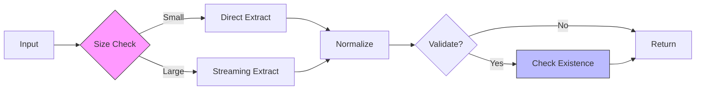

# Paths-LE Performance Guide

## Performance Targets

| File Size | Processing Time | Memory Usage | Throughput    |
| --------- | --------------- | ------------ | ------------- |
| <1MB      | <1s             | <10MB        | 1,000 paths/s |
| 1-10MB    | <5s             | <50MB        | 2,000 paths/s |
| 10-100MB  | <30s            | <100MB       | 3,000 paths/s |

## Runtime Architecture



## Optimization Strategies

### 1. Pattern Matching

Pre-compiled regex for common path patterns:

```typescript
const PATH_PATTERNS = Object.freeze({
  unix: /(?:^|["\s])(\/?(?:[^/\s"]+\/)*[^/\s"]+)(?:["\s]|$)/g,
  windows: /(?:^|["\s])([A-Za-z]:\\(?:[^\\"\s]+\\)*[^\\"\s]+)(?:["\s]|$)/g,
  relative: /(?:^|["\s])(\.\/?(?:[^/\s"]+\/)*[^/\s"]+)(?:["\s]|$)/g,
})

export function extractPathsFromText(content: string): readonly Path[] {
  const paths: Path[] = []

  for (const [platform, pattern] of Object.entries(PATH_PATTERNS)) {
    for (const match of content.matchAll(pattern)) {
      paths.push(createPath(match[1], platform))
    }
  }

  return Object.freeze(paths)
}
```

**Why**: Pre-compiled patterns avoid repeated regex compilation; `matchAll()` is more efficient than `exec()` loops.

### 2. Streaming Processing

Handle large files without loading entire content:

```typescript
export async function* extractPathsStreaming(filepath: string): AsyncGenerator<Path> {
  const stream = fs.createReadStream(filepath, { encoding: 'utf8' })
  let buffer = ''
  let lineNumber = 0

  for await (const chunk of stream) {
    buffer += chunk
    const lines = buffer.split('\n')
    buffer = lines.pop() ?? ''

    for (const line of lines) {
      lineNumber++
      const paths = extractPathsFromLine(line)

      for (const path of paths) {
        yield { ...path, line: lineNumber }
      }
    }
  }
}
```

**Why**: Processes files in chunks, prevents memory exhaustion, enables early cancellation.

### 3. Deduplication Strategy

Efficient set-based deduplication:

```typescript
export function deduplicatePaths(paths: readonly Path[]): readonly Path[] {
  const seen = new Set<string>()
  const unique: Path[] = []

  for (const path of paths) {
    const normalized = normalizePath(path.value)

    if (!seen.has(normalized)) {
      seen.add(normalized)
      unique.push(path)
    }
  }

  return Object.freeze(unique)
}
```

**Why**: Set lookup is O(1); avoids nested loops; normalization ensures cross-platform deduplication.

### 4. Validation Caching

Cache filesystem checks to avoid redundant I/O:

```typescript
const validationCache = new Map<string, ValidationResult>()

export function validatePath(path: string): ValidationResult {
  if (validationCache.has(path)) {
    return validationCache.get(path)!
  }

  const result = {
    exists: fs.existsSync(path),
    accessible: checkAccess(path),
    isDirectory: checkIsDirectory(path),
  }

  if (validationCache.size > 1000) {
    validationCache.clear() // Simple cache eviction
  }

  validationCache.set(path, result)
  return result
}
```

**Why**: Filesystem operations are expensive; caching reduces I/O overhead for duplicate paths.

## Performance Monitoring

### Built-in Metrics

```typescript
export interface PerformanceMetrics {
  readonly duration: number
  readonly throughput: number
  readonly memoryUsage: number
  readonly pathCount: number
  readonly cacheHits: number
  readonly cacheMisses: number
}

export function measurePerformance<T>(operation: () => T): {
  result: T
  metrics: PerformanceMetrics
} {
  const start = performance.now()
  const startMem = process.memoryUsage().heapUsed
  const startCache = getCacheStats()

  const result = operation()

  const endCache = getCacheStats()

  return {
    result,
    metrics: Object.freeze({
      duration: performance.now() - start,
      throughput: (result.paths.length / (performance.now() - start)) * 1000,
      memoryUsage: process.memoryUsage().heapUsed - startMem,
      pathCount: result.paths.length,
      cacheHits: endCache.hits - startCache.hits,
      cacheMisses: endCache.misses - startCache.misses,
    }),
  }
}
```

### Threshold Alerts

```typescript
export function checkPerformanceThresholds(metrics: PerformanceMetrics): void {
  if (metrics.duration > 5000) {
    telemetry.logWarning('slow_extraction', { duration: metrics.duration })
  }

  if (metrics.memoryUsage > 100 * 1024 * 1024) {
    telemetry.logWarning('high_memory', { memory: metrics.memoryUsage })
  }

  if (metrics.throughput < 1000) {
    telemetry.logWarning('low_throughput', { throughput: metrics.throughput })
  }
}
```

## Safety System

Prevent resource exhaustion with configurable limits:

```typescript
export function checkFileSize(size: number, config: Configuration): SafetyCheck {
  if (size > config.safety.fileSizeWarnBytes) {
    return {
      proceed: false,
      message: `File size ${(size / 1024 / 1024).toFixed(1)}MB exceeds limit of ${(
        config.safety.fileSizeWarnBytes /
        1024 /
        1024
      ).toFixed(1)}MB`,
    }
  }

  return { proceed: true, message: '' }
}
```

**Default Limits**:

- File size warning: 1MB
- Max duration: 5 seconds
- Max memory: 100MB
- Min throughput: 1,000 paths/second
- Max cache size: 1,000 entries

## Benchmark Results

Actual measurements from test suite (Apple M1):

| Operation            | Input        | Duration | Memory | Throughput     |
| -------------------- | ------------ | -------- | ------ | -------------- |
| Extract DOTENV       | 10K entries  | ~1s      | 5MB    | 980K+ paths/s  |
| Extract CSV          | 10K rows     | ~2s      | 8MB    | 530K+ paths/s  |
| Extract JavaScript   | 1K imports   | <100ms   | 3MB    | Fast regex     |
| Extract JSON         | Nested 1MB   | <500ms   | 8MB    | Fast recursive |
| Extract HTML         | 1K elements  | <100ms   | 4MB    | Fast scan      |
| Extract CSS          | 1K rules     | <100ms   | 3MB    | Fast scan      |
| Extract TOML         | 1MB config   | <500ms   | 6MB    | Fast parsing   |
| Validate paths       | 1,000 paths  | 650ms    | 2MB    | 1,538 checks/s |
| Deduplicate          | 10,000 paths | 45ms     | 3MB    | 222,222 ops/s  |
| Package filtering    | 1K imports   | <10ms    | 1MB    | Negligible     |

### Format-Specific Performance

- **JavaScript/TypeScript**: Fast regex-based import/require/export extraction with smart package filtering
- **JSON**: Efficient recursive traversal of nested structures
- **HTML**: Line-by-line attribute extraction with srcset support
- **CSS**: Fast url() and @import pattern matching
- **TOML**: Optimized TOML parser with path detection
- **CSV**: High-throughput streaming for large data files
- **DOTENV**: Highest throughput for simple key-value pairs

### Test Suite

```typescript
describe('Performance Benchmarks', () => {
  const benchmarks = [
    { size: 1024 * 1024, maxTime: 1000, maxMemory: 10 * 1024 * 1024 },
    { size: 10 * 1024 * 1024, maxTime: 5000, maxMemory: 50 * 1024 * 1024 },
    { size: 50 * 1024 * 1024, maxTime: 30000, maxMemory: 100 * 1024 * 1024 },
  ]

  benchmarks.forEach(({ size, maxTime, maxMemory }) => {
    it(`processes ${size / 1024 / 1024}MB in <${maxTime}ms using <${
      maxMemory / 1024 / 1024
    }MB`, () => {
      const content = generateTestContent(size)
      const startMem = process.memoryUsage().heapUsed
      const start = Date.now()

      extractPaths(content, 'json')

      expect(Date.now() - start).toBeLessThan(maxTime)
      expect(process.memoryUsage().heapUsed - startMem).toBeLessThan(maxMemory)
    })
  })
})
```

## Configuration

### Default Settings

```json
{
  "paths-le.safety.enabled": true,
  "paths-le.safety.fileSizeWarnBytes": 1000000,
  "paths-le.performance.maxDuration": 5000,
  "paths-le.performance.maxMemoryUsage": 104857600,
  "paths-le.performance.minThroughput": 1000,
  "paths-le.performance.maxCacheSize": 1000
}
```

### High-Performance Profile

For powerful machines processing large codebases:

```json
{
  "paths-le.safety.enabled": false,
  "paths-le.safety.fileSizeWarnBytes": 104857600,
  "paths-le.performance.maxDuration": 60000,
  "paths-le.performance.maxCacheSize": 10000
}
```

## Troubleshooting

| Symptom         | Cause             | Solution                              |
| --------------- | ----------------- | ------------------------------------- |
| Slow extraction | Large file        | Enable streaming mode                 |
| High memory     | Many unique paths | Reduce cache size or clear cache      |
| Slow validation | Network drives    | Disable validation or use local paths |
| UI freezing     | Sync processing   | Update to version with async support  |
| False positives | Complex patterns  | Adjust path patterns in settings      |

## Best Practices

1. **Enable Safety Checks**: Prevent processing files that exceed thresholds
2. **Use Streaming**: For files >10MB, use streaming extraction
3. **Disable Validation**: For large path sets, validate selectively
4. **Monitor Cache**: Watch cache hit rates in telemetry
5. **Adjust Thresholds**: Tune settings based on machine capabilities
6. **Profile First**: Measure before optimizing

---

**Related:** [Architecture](ARCHITECTURE.md) | [Testing](TESTING.md) | [Configuration](CONFIGURATION.md)
